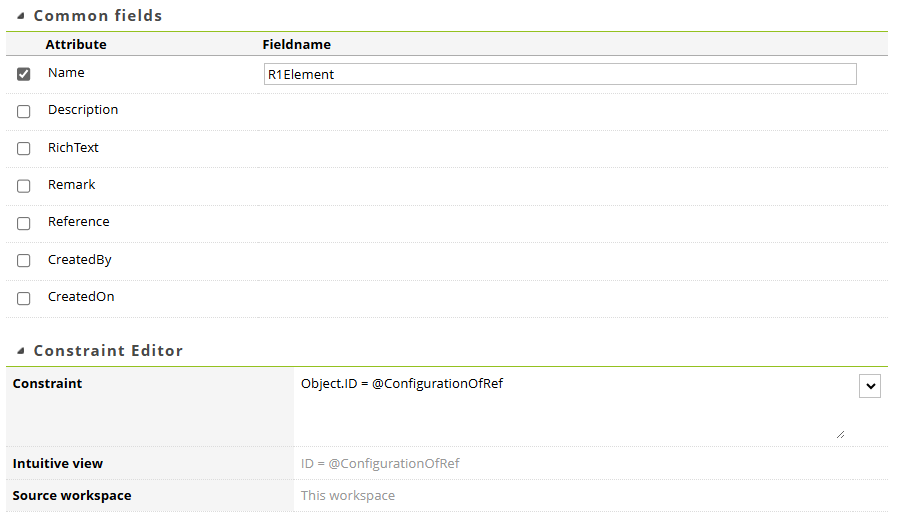
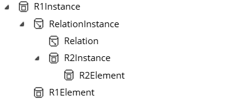
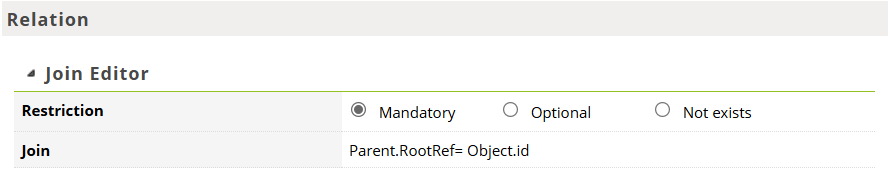
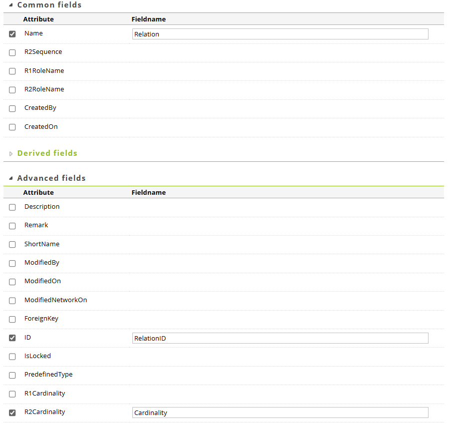

# Setting up Relatics Reports and Webservices
## Introduction

In order to extract all Element data a very specific relatics report and webservice needs to be setup. This webservice will be used by the `relatics_toolkit.extract_element_tables` function in order to produce the full extraction.

The function will do the following:

- Loop over the provided ElementID list to be extracted.
- Produce a table with the Name, Description, RichText and GUID of the Element, append all properties, and append all relations with a to-one cardinality.
- Produce a link table for each relation the element has to other elements with to-many cardinality. 
- Combine all these tables into a dictionary and return it.

!!! danger "Warning!"
    Don't skip any steps in this setup. Copy names and query patterns exactly. The `extract_element_tables` method has no flexibility in report part naming and the naming of the query values should therefore match this guide.

!!! tip
    Ensure that after creating a report you enter the *output extension* to be **xml**

## Setting up the Report structure
The report in relatics needs to be the following structure:

#### Element
This Part is the entry point for the extractor, it takes the ConfigurationOfRef of the desired, to be extracted, element as parameter and will generate the report from this information.
The R1Element and R1ElementID are important pieces of information to cleanly construct the tables.

#### ElementInstances
The Table for element instances will be used to generate the element table with information about the element itself. and you set it up like this:

#### Properties
This table gives you the information about all properties that could exist. This is needed to make a consistent table with all possible fields present, even when they're empty.

Below are the node details for each node in the query:

*R1Element*:

Nothing is selected in this section, the only relevant part is in the constraint:

*Property*:

#### PropertyInstances

This table returns the actual properties with their value. Set it up like this.

*R1Instance*:

You set up the constraint and advanced fields.

*PropertyInstance*:

You set up the Advanced fields an Join Editor.

#### Relations
This table gives you the possible relations an element can have, akin to the *Properties* table.

*R1Element*:

Modify Common fields and the Constraint Editor:

*Relation*:

Modify the Join Editor, Common fields and Advanced fields.

*R2Element*:

Modify the Common fields, Advanced fields and Join Editor.

*All types*:

#### RelationInstances
This table gives you the actual relations an element has.

*R1Instance*:

Modify the Common fields, Constraint editor and Advandec fields section:

*Relation*:

Modify the Common fields, Join Editor and Advanced fields.

*R2Instance*:

Modify the Common fields, Advanced fiels and Join Editor.

*R2Element*:

Modify the Common fields, Advanced fields and Join Editor.

*R1Element*:

Modify Common fields and Join Editor.
